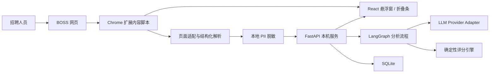

# AI Recruitment Copilot V1 技术设计

状态：已完成方案讨论，等待书面规格复核

日期：2026-07-28

目标仓库：`EASONLEO0314/AI-Recruitment-Copilot`

## 1. 背景与目标

招聘人员目前需要在 BOSS 直聘候选人页面中逐份阅读简历、对照岗位要求判断匹配度，并手工组织沟通话术。这个过程重复、耗时，而且不同招聘人员的判断口径不容易保持一致。

V1 的目标是在不改变招聘人员主要浏览习惯的前提下，提供一个嵌入 BOSS 页面右侧的 AI 招聘助手：提取当前候选人信息，按照岗位标准生成有证据的匹配分析，支持人工调整评分权重，并生成可复制的沟通建议。列表页支持招聘人员手动滚动时批量采集已出现的候选人摘要，但不自动翻页、点击或发送消息。

V1 首先服务于单人、单机的内部使用场景，优先验证实际可用性、分析质量和页面适配稳定性。系统不建设账号与权限体系。后续可将后端部署到用户的阿里云服务器，再演进到多人协作。

## 2. 设计原则

1. **人在回路中**：AI 提供建议、解释和草稿，最终判断、联系和发送均由招聘人员执行。
2. **证据优先**：每个维度的评分必须引用候选人资料中的具体事实；缺少信息时明确标注，不允许臆测。
3. **评分可控**：LLM 根据岗位描述生成初始维度和权重，招聘人员可以修改；最终总分由本地后端按确定性公式计算。
4. **最小化采集**：只保存业务所需的结构化数据，不保存完整网页 DOM；提交云端 LLM 前在本地移除姓名、电话和邮箱等个人身份信息。
5. **低侵入交互**：使用网页悬浮窗和右侧折叠条，不遮挡候选人主要内容，也不接管招聘人员的页面操作。
6. **安全渐进**：V1 仅监听本机回环地址；在迁移到阿里云之前补充账号、鉴权、传输加密和多人数据隔离。

## 3. 范围

### 3.1 V1 包含

- 在支持的 BOSS 候选人详情页提取结构化简历信息。
- 在招聘人员手动滚动候选人列表时，采集已经渲染的候选人摘要并去重。
- 根据岗位描述生成一套建议的评分维度、判断标准和权重。
- 允许招聘人员修改维度、标准和权重，并保存配置版本。
- 对单个候选人执行多维度匹配分析，展示总分、分项分数、理由、证据、置信度和风险提示。
- 展示信息不足项和建议进一步确认的问题。
- 生成打招呼、邀约面试和电话沟通话术，一键复制到剪贴板。
- 在本机保存岗位、候选人结构化资料、评分配置、评估结果和必要的运行记录。
- 以开发者模式安装 Chrome Manifest V3 扩展，并在本机启动 Python 服务。

### 3.2 V1 不包含

- 自动翻页、自动打开候选人、自动打招呼、自动发送消息或其他代替招聘人员的页面操作。
- 账号、组织、角色、权限和多人协作。
- 云端集中数据库和跨设备同步。
- 自动淘汰候选人或以单个硬性条件直接作出录用决策。
- 完整招聘流程管理、面试排期、Offer 管理或 ATS 替代能力。
- 对 BOSS 页面做绕过访问控制、验证码或反自动化机制的处理。

## 4. 用户工作流

### 4.1 首次设置岗位

1. 招聘人员打开悬浮窗并新建岗位，粘贴岗位描述。
2. LLM 返回建议的评分维度、每个维度的判断标准及权重。
3. 招聘人员检查并调整内容；保存时各维度权重必须合计为 100%。
4. 系统生成不可变的评分配置版本，之后的每次评估都记录所使用的版本。

### 4.2 浏览并评估候选人

1. 招聘人员在 BOSS 页面选择当前岗位并打开候选人详情。
2. 扩展只读取当前页面已展示的候选人资料，将其转换为统一结构。
3. 扩展在本地移除个人身份信息，将脱敏后的候选人资料和当前评分配置发送给本机后端。
4. 后端调用 LLM 获取各维度判断、分数、证据和置信度，再以确定性公式计算总分。
5. 悬浮窗展示结果。招聘人员可以展开维度查看原因、复制沟通建议，或记录需要进一步确认的问题。
6. 招聘人员离开详情页后，悬浮窗收起为右侧窄条，不妨碍原页面浏览。

### 4.3 列表页批量摘要

1. 招聘人员正常浏览并手动滚动候选人列表。
2. 扩展监听页面中已经出现的候选人卡片，仅提取可见摘要。
3. 系统按平台候选人标识优先、稳定字段指纹兜底的方式去重。
4. 新候选人进入本地待分析队列；队列按有限并发处理，不触发任何页面点击或翻页。
5. 批量结果用于初步排序和提示，进入详情页后再以完整资料生成正式评估。

## 5. 系统架构



系统分为浏览器扩展、本机后端、LLM 适配层和本地数据存储四个边界。扩展负责页面环境内的读取与交互；后端负责业务规则、版本化、模型调用和持久化；LLM 只负责生成建议和基于证据的分项判断；总分计算不交给模型。

### 5.1 Chrome 扩展

- 技术栈：Manifest V3、TypeScript、React。
- `content script` 检测支持的页面类型、读取已渲染内容并监听单页应用路由变化。
- 页面解析器按“页面类型 + 适配器版本”隔离，避免选择器散落到 UI 或网络代码中。
- UI 挂载在 Shadow DOM 中，隔离 BOSS 页面的 CSS，降低样式冲突。
- 扩展仅与 `http://127.0.0.1:<port>` 通信；CORS 只允许本扩展来源。
- 不注入自动点击、自动输入或自动发送逻辑。

### 5.2 本机后端

- 技术栈：Python、FastAPI、LangGraph、SQLite。
- FastAPI 提供类型化 JSON API、输入校验、超时控制和健康检查。
- LangGraph 只编排固定步骤：输入校验、信息充分性检查、LLM 分析、结构化输出校验、重试及结果组装；V1 不允许模型自行选择页面工具或执行开放式代理动作。
- 评分引擎验证权重并计算总分，保证同一组分项结果与配置得到相同总分。
- SQLite 保存结构化业务数据和版本信息。数据库路径位于本机应用数据目录，不写入代码仓库。

### 5.3 LLM 适配层

- 使用统一 Provider 接口封装具体模型供应商，业务层不依赖某一家 SDK。
- 模型名称、接口地址、密钥、超时和最大重试次数通过本机环境配置提供。
- 所有模型响应必须通过 JSON Schema 校验；无效响应最多重试一次，仍失败则返回可恢复错误。
- 发送给模型的输入只包含岗位要求、脱敏后的候选人事实、评分标准及必要上下文。

## 6. 网页悬浮窗交互设计

### 6.1 展开状态

悬浮窗固定在页面右侧，默认宽度约 380–420 像素，可纵向滚动。顶部显示当前岗位、切换岗位入口、折叠和关闭按钮。主体依次展示：

- 总匹配分和建议等级；
- 各评分维度的进度条、分数与置信度；
- 候选人亮点；
- 风险提示和待确认问题；
- 详细分析折叠项；
- 联系候选人、索要正式简历、暂不联系等人工决策入口；
- 打招呼、邀约面试、电话沟通三类话术及复制按钮。

悬浮窗不覆盖 BOSS 页面导航和主要简历阅读区域。屏幕空间不足时优先缩小悬浮窗宽度，不修改原页面布局。

### 6.2 折叠状态

折叠后显示为右侧窄条，保留 AI 标识、总分、简短状态和展开箭头。分析未完成时展示进度状态，失败时展示可重试标识。折叠不清除当前候选人的结果。

### 6.3 反馈与控制

- 分析期间显示明确的加载阶段，禁止重复提交同一候选人与配置版本的请求。
- 复制话术后提供短暂成功提示，但不会向网页输入框自动写入内容。
- 招聘人员切换岗位后，当前候选人必须按新配置重新评估，旧结果仍保留其岗位和配置版本。
- 页面字段缺失时保留可用分析，并在对应维度标记“信息不足”。

## 7. 数据模型

### 7.1 Job

- `id`
- `title`
- `description`
- `status`
- `created_at` / `updated_at`

### 7.2 EvaluationConfig

- `id`
- `job_id`
- `version`
- `source`：`llm_suggested` 或 `hr_edited`
- `dimensions[]`
  - `key`
  - `name`
  - `description`
  - `rubric`
  - `weight`：整数百分比
- `created_at`

配置保存条件是所有权重均在 0–100 之间且总和严格等于 100。已用于评估的版本不原地修改；招聘人员调整后创建新版本。

### 7.3 CandidateProfile

- `id`
- `source`：V1 固定为 `boss`
- `source_candidate_id`：页面可用时保存平台标识
- `fingerprint`：无平台标识时用于去重
- `current_title`
- `location`
- `experience_years`
- `education[]`
- `work_experiences[]`
- `project_experiences[]`
- `skills[]`
- `research_or_domain_experiences[]`
- `summary`
- `missing_fields[]`
- `parser_version`
- `captured_at`

姓名、电话和邮箱不进入发送给云端模型的对象。V1 允许扩展在当前页面会话中临时显示姓名，但持久化层默认只保存平台标识或本地匿名标识。

### 7.4 Assessment

- `id`
- `candidate_id`
- `job_id`
- `evaluation_config_id`
- `model_provider` / `model_name`
- `prompt_version`
- `profile_snapshot_hash`
- `dimension_results[]`
  - `dimension_key`
  - `score`：0–100
  - `confidence`：0–1
  - `reason`
  - `evidence[]`
  - `missing_information[]`
- `total_score`：0–100
- `highlights[]`
- `risk_flags[]`
- `follow_up_questions[]`
- `status`
- `created_at`

### 7.5 MessageSuggestion

- `assessment_id`
- `type`：`greeting`、`interview_invitation` 或 `phone_script`
- `content`
- `prompt_version`
- `created_at`

## 8. 评分与解释规则

LLM 为每个维度返回 0–100 的分项分数、理由、证据和置信度。后端按下式计算总分：

```text
total_score = round(sum(dimension_score × dimension_weight) / 100)
```

规则如下：

- 总分只由当前配置版本中的维度和权重决定。
- 风险提示单独展示，不执行自动淘汰；如果某项风险本身属于评分标准，其影响必须已经体现在对应维度分数中，不能再做隐藏扣分。
- 没有证据支持的判断不得获得高置信度。信息缺失不等于不符合，模型必须区分“未提及”和“明确不具备”。
- 每条证据包含字段路径或候选人事实摘要，UI 可追溯到结构化资料中的来源部分。
- 总分相同不代表候选人等价；UI 必须同时展示分项、置信度和风险，避免用单一数字替代人工判断。

## 9. API 边界

V1 API 使用 `/v1` 前缀，核心接口如下：

- `GET /healthz`：本机服务状态。
- `POST /v1/jobs`：创建岗位。
- `POST /v1/jobs/{job_id}/criteria:suggest`：由 LLM 生成初始评分配置。
- `POST /v1/jobs/{job_id}/evaluation-configs`：保存招聘人员确认或修改后的新版本。
- `GET /v1/jobs`：岗位与当前配置列表。
- `POST /v1/candidates:upsert`：写入单个或列表页候选人结构化资料并去重。
- `POST /v1/assessments`：创建正式评估；相同快照与配置可复用已有结果。
- `GET /v1/candidates/{candidate_id}/assessments`：读取历史评估。
- `POST /v1/assessments/{assessment_id}/messages:suggest`：生成三类沟通建议。

所有接口响应包含 `request_id`。错误体统一包含 `code`、`message`、`retryable` 和可选 `details`，扩展不依赖后端堆栈信息。

## 10. 数据流与隐私

1. 页面解析在 Chrome 扩展本地完成。
2. 解析结果先经过字段白名单，只保留数据模型定义的内容。
3. 脱敏器移除姓名、手机号、邮箱及文本中重复出现的对应信息，并用稳定占位符替换必要指代。
4. 脱敏结果通过本机回环接口进入后端。
5. 后端再次执行脱敏断言；发现已知 PII 模式时拒绝发起模型调用并返回可修复错误。
6. LLM 返回结构化分析，后端校验、计算总分并持久化。
7. 扩展只获取展示所需结果。

日志默认不记录简历正文、提示词全文、模型密钥或个人身份信息。可记录请求编号、耗时、解析器版本、模型名称、token 用量、错误码和结果状态。

## 11. 错误处理与降级

### 11.1 页面结构变化

解析器输出字段覆盖率和适配器版本。无法识别页面时停止分析，提示“当前页面结构暂不支持”，并记录不含简历正文的诊断信息。单个非核心字段缺失时继续处理并标记信息不足。

### 11.2 本机服务不可用

扩展折叠条显示离线状态，提供重试和启动说明。采集到的候选人摘要只保留在内存待处理队列中，不无限增长；达到上限后暂停入队并提示用户。

### 11.3 模型超时或输出不合法

模型调用设置超时。超时、限流和无效结构最多自动重试一次，并使用指数退避。失败后保留已解析资料，不生成虚假分数，允许用户手动重试。

### 11.4 快速切换页面

每次分析绑定页面实例、候选人指纹、岗位 ID 和配置版本。用户切换页面后取消旧的前端等待状态；晚到的响应可以入库，但不得覆盖当前界面候选人的结果。

### 11.5 重复候选人

优先使用平台候选人标识去重；缺失时使用稳定字段组合的哈希。摘要升级为详情资料时更新同一候选人记录，并保留资料快照哈希用于判断是否需要重评。

## 12. 测试策略

### 12.1 单元测试

- 页面解析器：详情页、列表卡片、缺失字段、文本格式变化和不支持页面。
- PII 脱敏：姓名、不同格式手机号、邮箱、正文重复信息和误报边界。
- 权重校验与总分公式：边界值、非法权重、舍入和确定性。
- 去重与快照哈希：同一候选人的摘要、详情和资料更新。
- LLM Schema 校验：正常、缺字段、越界分数、无证据和无法解析的响应。

### 12.2 契约与集成测试

- TypeScript 客户端类型与 FastAPI OpenAPI 契约保持一致。
- 使用伪造 LLM Provider 验证岗位配置生成、正式评估、重试、缓存和话术生成全流程。
- 验证模型调用前的数据已通过字段白名单和 PII 断言。
- 验证同一评估输入重复提交不会产生不一致总分或重复并发任务。

### 12.3 浏览器与人工验收

- 在固定的匿名化页面样本上测试路由切换、展开/折叠、列表滚动采集和详情评估。
- 在至少 20 份经授权且匿名化的候选人样本上对照人工标注。
- 核心字段解析成功率达到 95% 以上；核心字段指岗位判断所需且页面实际存在的工作经历、教育经历、项目/技能及基本年限信息。
- 已知 PII 测试集在发往模型前的拦截率达到 100%。
- 招聘人员认为“无需重写即可使用或只需轻微修改”的评估结论比例达到 80% 以上。
- 悬浮窗不得阻塞原页面滚动、候选人切换和正常消息操作。
- 所有沟通建议只能复制，不能自动发送。

## 13. 本地运行与配置

V1 采用两个可独立启动的单元：

- Chrome 扩展构建产物：通过 Chrome 开发者模式加载。
- 本机 Python 服务：启动后仅监听 `127.0.0.1`，使用 SQLite 和本机环境变量中的模型配置。

代码仓库提供脱敏后的 `.env.example`、启动说明和健康检查步骤。真实 API 密钥、SQLite 数据库、日志和候选人数据都必须加入 `.gitignore`，不得提交到 GitHub。

## 14. 后续演进

第二阶段可在验证 V1 价值后，将 FastAPI 服务和数据库迁移到用户的阿里云服务器，并增加：

- 账号登录、组织和角色权限；
- HTTPS、服务端鉴权、密钥托管和审计日志；
- 多人共享岗位与候选人、操作记录和数据隔离；
- 团队级评分模板与校准分析；
- 在平台规则和合规评估允许的前提下，研究更高程度的流程辅助。

迁移到云端之前，不允许直接暴露 V1 的本机接口，也不允许以“内部使用”为由跳过鉴权和数据隔离。

## 15. V1 完成定义

V1 可进入日常试用需同时满足：

1. 招聘人员能创建岗位、接受或修改 LLM 建议权重，并保存配置版本。
2. 支持页面能够稳定提取候选人资料，且解析成功率达到验收标准。
3. 单候选人评估能展示可追溯的分项证据、总分、置信度、风险和待确认问题。
4. 列表页只在人工滚动过程中采集已出现摘要，不执行自动页面操作。
5. 三类沟通话术均可生成和复制，但不能自动发送。
6. PII 脱敏、模型输出校验、失败重试和本机离线提示均通过测试。
7. 数据可在本机重启后恢复，且仓库中不存在真实密钥和候选人数据。
8. 20 份匿名化样本的解析与 HR 可用性指标达到第 12.3 节门槛。
