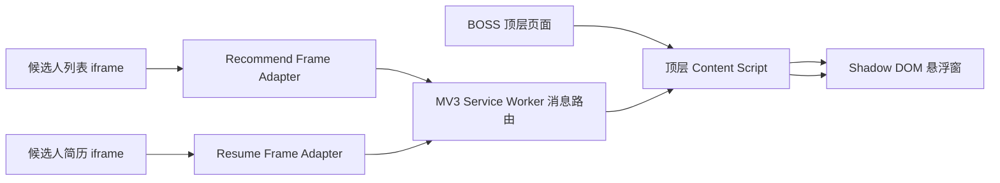

# M2 BOSS 页面只读解析设计

状态：已完成方案讨论，等待书面规格复核

日期：2026-07-29

## 1. 目标

M2 在现有 Chrome Manifest V3 扩展中增加 BOSS 页面识别和候选人资料解析能力，把页面已经渲染且当前账号有权查看的内容转换为统一的本地结构化对象，并在悬浮窗中显示读取状态与资料预览。

本阶段结束于“真实页面 → 结构化候选人资料 → 本地预览”。M1 的 92 分评估仍然是明确标记的演示数据，不得暗示它由真实候选人资料生成。

## 2. 已选方案及取舍

采用“frame-aware、DOM-first、事件驱动、本地只读”的解析方案：

- 通过 Chrome Content Script 进入匹配的 BOSS 主页面及其 iframe。
- 只用标准 DOM API 读取已经渲染的文本与安全属性。
- 主页面只负责悬浮窗；候选人列表 iframe 和简历 iframe 分别运行独立适配器。
- 适配器通过扩展消息传递结构化快照，不传输完整 HTML 或 DOM。
- 页面变化通过限定范围的 `MutationObserver` 与防抖触发，不进行高频全页轮询。

不采用以下方案：

- `chrome.debugger`、CDP 或 WebDriver：侵入性和被页面识别的风险更高，也不是产品运行所必需。
- 拦截或逆向 BOSS 私有接口：依赖内部协议、令牌和接口字段，维护与合规风险高。
- 截图加 OCR：准确率、性能和隐私成本较高，仅可在后续阶段另行评估。

## 3. 范围与安全边界

### 3.1 M2 包含

- 识别未登录、非候选人、候选人列表和候选人简历四类页面状态。
- 在未登录页面只读取用于分类的最小信息：域名、路径类别、页面标题和登录墙是否存在。
- 从已渲染的候选人列表卡片读取可见摘要。
- 从已渲染的简历区域读取基本资料、工作经历、教育经历、项目经历和技能等可用字段。
- 在悬浮窗显示解析状态、字段覆盖率、缺失字段和本地结构化预览。
- 支持候选人切换后的事件驱动更新以及人工“重新读取”。
- 使用匿名 HTML fixture、单元测试和人工浏览器验收验证解析稳定性。

### 3.2 M2 不包含

- 自动点击、自动滚动、自动翻页、自动打开候选人或自动发送消息。
- 读取 Cookie、访问令牌、请求头、浏览器密码或页面网络响应。
- 绕过登录、验证码、访问控制、反自动化机制或平台限制。
- 保存完整 DOM、原始 HTML、截图或真实候选人资料到仓库、测试、日志或云端。
- LLM 调用、正式匹配评分、SQLite 持久化、批量自动采集和云端部署。

被折叠、尚未加载或以图片、canvas 展示的内容视为缺失；解析器不得为了补齐字段而操作页面。

## 4. 扩展架构



Manifest 保持最小权限，并对 `https://www.zhipin.com/*` 启用 `all_frames: true`。M2 不扩大到不确定的 BOSS 子域；若后续发现合法目标 iframe 使用其他来源，再依据实际 URL 单独增加匹配范围。

同一个 `content.js` 根据执行上下文承担不同职责：

- `window.top === window`：挂载一次悬浮窗、订阅结构化快照、发出人工重新读取命令。
- iframe：识别当前 frame 类型，启动对应解析适配器；不挂载悬浮窗。
- 不支持的 frame：保持静默，不创建观察器。

Content Script 运行在扩展隔离环境中，但可以读取其所在 frame 的 DOM。顶层脚本不跨 frame 直接访问文档，以避免同源假设和职责耦合。

## 5. 组件边界

### 5.1 Page Classifier

输入为当前 frame 的 `location`、`document.title` 和少量 DOM 特征，输出：

- `logged_out`
- `non_candidate`
- `recommend_frame`
- `resume_frame`
- `unsupported`

分类器只判断页面类型，不提取候选人正文。未登录状态是正常状态，不记为解析错误。

### 5.2 Recommend Frame Adapter

只负责候选人列表卡片。它在已渲染卡片范围内提取可见姓名或本地展示标签、当前职位、年限、学历、期望职位和期望城市等摘要字段。每个字段使用集中定义的选择器候选集合，并记录使用的适配器版本。

适配器不触发卡片点击，也不为了获取更多卡片主动滚动。用户正常滚动产生的新卡片可以触发重新解析，但 M2 只在内存中生成当前页面快照，不建立批处理队列。

### 5.3 Resume Frame Adapter

只负责当前已打开的简历内容。它按区域提取：

- 基本资料与职业摘要；
- 工作经历；
- 教育经历；
- 项目经历；
- 技能或领域标签。

解析器优先使用稳定容器和语义标题定位区域，再在区域内部读取字段，避免把选择器散落到 UI 或消息代码中。无法确定归属的文本不写入结构化字段。

### 5.4 Parser Coordinator

协调器负责首次解析、400 毫秒防抖、相同指纹去重、观察器释放和人工重新读取。观察器只绑定已识别的 BOSS 内容根节点，配置为读取必要的子节点和文本变化，不观察扩展的 Shadow DOM。

每次解析只读 DOM。协调器和适配器不得调用 `click()`、`focus()`、`scrollTo()`、`history`、`location`、表单写入或页面存储 API。

### 5.5 Service Worker Router

iframe 通过 `chrome.runtime.sendMessage` 发送带类型的解析快照。Service Worker 使用消息发送者提供的 `tabId`、`frameId` 和 `documentId` 识别来源，并把快照转发到同一标签页的顶层 Content Script。

路由器不持久化候选人正文。标签页关闭、刷新或扩展 Service Worker 回收后，内存状态可以丢失；重新解析即可恢复。

### 5.6 Parser Preview

悬浮窗增加独立的“页面读取”区域，至少显示：

- 页面状态：等待页面、未登录、非候选人页面、已读取、部分读取、不支持或读取失败；
- 数据来源：`BOSS 页面（仅本地）`；
- 适配器版本、读取时间和字段覆盖率；
- 结构化字段预览、缺失字段及“重新读取”按钮。

页面读取结果和 M1 演示评估必须视觉分区。真实解析结果出现时，现有演示分数仍显示“演示数据”，不得改成真实评估标签。

## 6. 数据契约

frame 适配器只允许发送以下白名单结构，不允许附加 `innerHTML`、`outerHTML`、Cookie、完整 URL 查询参数或未分类正文：

```ts
type PageKind =
  | 'logged_out'
  | 'non_candidate'
  | 'recommend_frame'
  | 'resume_frame'
  | 'unsupported';

type ParserStatus =
  | 'waiting'
  | 'ready'
  | 'partial'
  | 'unsupported'
  | 'error';

interface CandidateProfile {
  display_name?: string;
  current_title?: string;
  location?: string;
  experience_years?: number;
  expected_position?: string;
  expected_city?: string;
  education: EducationExperience[];
  work_experiences: WorkExperience[];
  project_experiences: ProjectExperience[];
  skills: string[];
  summary?: string;
}

interface ParserSnapshot {
  schema_version: 1;
  parser_version: string;
  page_kind: PageKind;
  status: ParserStatus;
  captured_at: string;
  fingerprint?: string;
  profile?: CandidateProfile;
  present_fields: string[];
  missing_fields: string[];
  warnings: string[];
}
```

`fingerprint` 只用于同一标签页内判断内容是否变化，由非敏感稳定字段的规范化结果生成，不作为跨设备身份标识。M2 不把快照发送给本地后端或外部服务。

## 7. 数据流

1. 顶层页面和匹配 iframe 在 `document_idle` 加载 Content Script。
2. 顶层脚本只挂载悬浮窗；各 frame 运行页面分类器。
3. 未登录顶层页面产生最小状态快照，不读取候选人字段。
4. 已识别的列表或简历 frame 运行对应适配器并生成白名单快照。
5. 快照在发送前进行结构校验、字符串长度限制、空值清理和字段覆盖率计算。
6. Service Worker 将快照转发给同一标签页顶层脚本。
7. 顶层脚本以最新 `documentId` 和快照时间为准更新预览，过期 frame 的迟到消息不得覆盖当前候选人。
8. 目标内容变化时，防抖后重新解析；若指纹未变化，不发送重复快照。
9. 用户点击“重新读取”时，路由器向当前标签页各 frame 广播只读解析命令；不触发页面行为。

## 8. 页面稳定性与账号风险控制

实现不能保证平台账号绝对没有风控风险，但必须把扩展行为限制为与普通页面展示兼容的被动读取：

- 不使用外部 Chrome 检查、CDP、WebDriver 或调试器连接验证登录页面。
- 不捕获网络请求，不调用平台私有 API，不模拟人类操作。
- 不使用定时全页扫描；首次读取后只监听限定容器。
- 不修改 BOSS 页面节点、样式、输入框或滚动位置；唯一注入节点是顶层页面的扩展 Shadow DOM 宿主。
- 不在 iframe 挂载 UI，避免重复节点和观察器自触发。
- 同一 DOM 指纹只上报一次，候选人快速切换时丢弃过期结果。
- 不在控制台或本地日志输出候选人正文。

如果页面出现自动刷新、验证码、访问限制或异常跳转，立即停止该轮页面测试，保留扩展自动操作为零的原则，不尝试规避平台机制。

## 9. 错误与降级

- 未登录：显示“BOSS 当前未登录；扩展已加载，登录后才可读取候选人资料”。
- 非候选人页面：显示“当前页面没有可读取的候选人资料”。
- 只找到部分字段：返回 `partial`，保留已读取字段并列出缺失项。
- DOM 结构未知：返回 `unsupported`，显示适配器版本，不做模糊全页抓取。
- frame 被销毁或候选人快速切换：取消旧观察器，迟到快照不得覆盖新状态。
- 解析器内部异常：返回不含正文的错误码和安全提示，人工重新读取可恢复。
- 图片或 canvas 内容：标记为缺失，不自动 OCR。

## 10. 测试策略

### 10.1 自动测试

- Manifest：BOSS 匹配范围、`all_frames: true`、顶层与 iframe 单一入口、无新增高风险权限。
- 页面分类器：未登录、非候选人、列表 frame、简历 frame 和未知结构。
- 适配器：完整匿名 fixture、缺失字段、字段顺序变化、空白规范化、重复节点和未知结构。
- 协调器：首次解析、防抖、指纹去重、观察器释放、人工重新读取和无 DOM 写入。
- 消息路由：同标签页转发、来源隔离、过期 `documentId` 丢弃、畸形消息拒绝。
- 悬浮窗：各解析状态、部分字段、缺失字段、演示评估标签不被真实页面状态替换。

所有 fixture 必须人工匿名化，不含真实姓名、电话、邮箱、公司内部信息或可还原候选人身份的组合。

### 10.2 未登录浏览器安全冒烟

第一轮只在确认未登录的 BOSS 页面执行，验证：

1. 悬浮窗只挂载一次。
2. 页面状态显示“未登录”，不显示候选人字段。
3. 人工“重新读取”只更新状态，不点击、滚动、导航或写入页面。
4. 连续观察至少 60 秒，页面没有因扩展读取发生可见自动刷新。
5. 浏览器开发者工具的页面网络记录中没有由解析器发起的 BOSS 请求；M1 本地健康检查仍可能访问 `127.0.0.1`。
6. 页面输入框、滚动位置和登录操作均未被改变。

未登录冒烟只能证明扩展注入、页面分类、消息链路和被动行为成立，不能证明候选人字段选择器有效。

### 10.3 登录后人工解析验收

由用户明确登录并授权后，使用至少 5 个有权查看的候选人页面进行人工对照：

- 解析期间无自动刷新、点击、滚动、导航或消息发送。
- 候选人切换后预览更新，不显示上一人的陈旧资料。
- 页面实际存在的核心字段提取正确率达到 95%；核心字段为工作经历、教育经历、项目经历、技能和基本年限信息。
- 不支持的页面有明确提示，部分字段不阻断其他可用字段。
- 测试记录只保存字段级通过/失败结果和匿名诊断，不保存真实候选人正文。

登录后的验收由用户观察悬浮窗并与页面人工核对，不再连接外部 CDP 或自动化检查工具到 BOSS 标签页。

## 11. 完成定义

M2 完成需要同时满足：

1. 所有新增解析、路由、Manifest 和 UI 自动测试通过，扩展类型检查与生产构建通过。
2. 未登录页面安全冒烟的六项检查全部有真实观察记录。
3. 登录后至少 5 个授权候选人页面达到字段准确率与稳定性验收标准。
4. 代码中不存在 BOSS 私有接口调用、调试器连接、自动页面操作或候选人正文日志。
5. README 明确说明 M2 的安装方式、读取边界、未登录测试步骤和真实评估尚未实现。
6. 最终报告区分自动验证、未登录人工验证、登录后人工验证和未实现功能，不把未执行项目写成完成。
